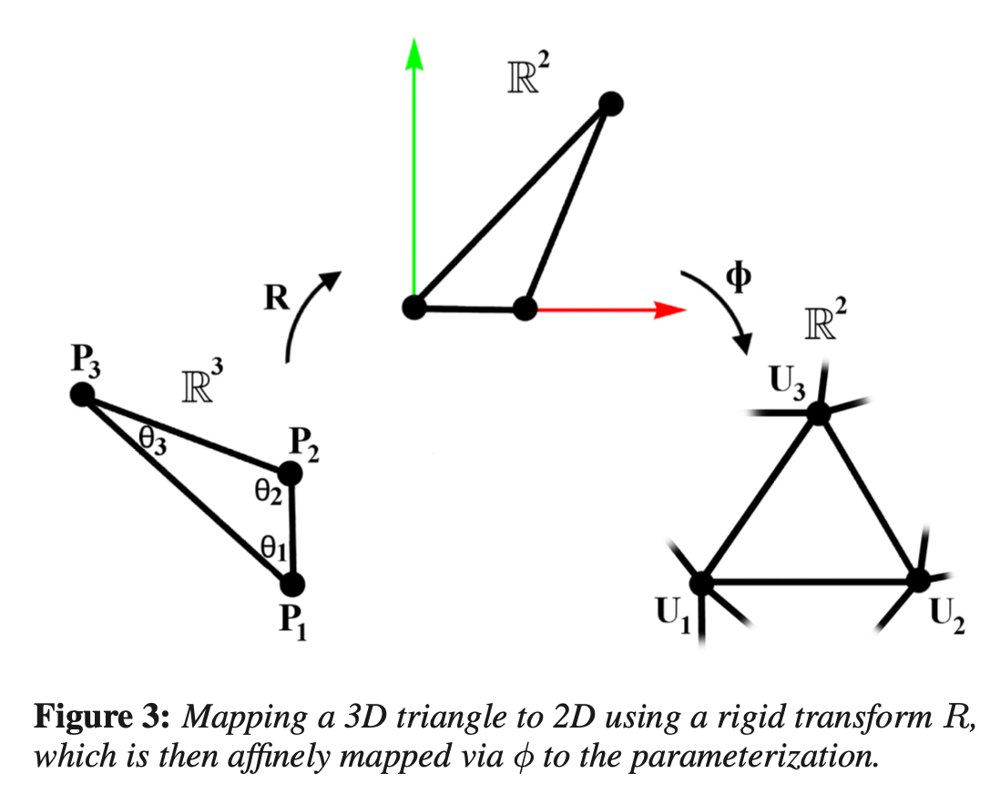

# Parameterization

## Bijective Parameterization with Free Boundaries

### Formulation

一般参数化常规套路：凸映射（Tutte's embedding）$\rightarrow$ 最小化扭曲能量（a distortion metric）。至于得到的结果是 local injective 还是 bijective 取决于能量设计。这类方法的本质是研究经过等比铺平后的 2D 三角形形变过程，即仿射变换（affine transformation），记为 $\phi$。

对于一个仿射变换的线性部分 $\phi = \begin{bmatrix}
 a &b \\
 c &d
\end{bmatrix}$ 的两个奇异值 $\sigma_1,\sigma_2(\sigma_2>\sigma_1)$ 决定了拉伸程度。故优化目标自然是使 $\sigma_1 = \sigma_2 = 1$，也就是常说的 isometric。所以，几乎所有主流参数化论文都可以表示成关于奇异值的能量$E(\sigma_1,\sigma_2)$，例如 LSCM: $(\sigma_1 -\sigma_2)^2$，ARAP: $(\sigma_1-1)^2+(\sigma_2-1)^2$，还有诸如MIPS: $(\dfrac{\sigma_2}{\sigma_1}+\dfrac{\sigma_1}{\sigma_2})$ 防止三角形退化，即$\sigma_1=0$。

当前我们讲述的这篇文章采用了如下形式：
$$
f(\sigma_1,\sigma_2)=(1+\sigma_1^{-2}\sigma_2^{-2})(\sigma_1^2+\sigma_2^2).
$$
其易于计算（见附录），防退化，优化目标一致（当 $\sigma_1=\sigma_2=1$ 时最小)。

注：$\sigma_1^2+\sigma_2^2$ 是 Dirichlet 能量。

故扭曲能量表示为：
$$
E_D=\sum_{t\in T}f(\sigma_{t,1},\sigma_{t,2})
$$
扭曲能量虽然能降低参数化后的形变，但是得到的结果往往是 locally injective，参见以往的方法。

要得到一个 bijective 且 扭曲尽可能低的参数化，一般都是从一个 bijective 但高扭曲的参数化出发，在优化能量的同时，每次迭代保证其不发生 overlap。

当前这篇文章对参数化边界边设计了如下的 barrier function：
$$
\max(0,\dfrac{\varepsilon}{\text{dist}(U_1,U_2,U_i)}-1)^2,i\neq1,2.
$$
其中 $(U_1,U_2)$ 为边界边，
$$
\text{dist}(U_1,U_2,U_i)>\varepsilon\Rightarrow f=0,\\
\text{dist}(U_1,U_2,U_i)\rightarrow 0\Rightarrow f\rightarrow\infty.
$$
故 barrier energy 表示为：
$$
E_B=\sum_{e_i=(U_1,U_2)}\sum_{U_{i\neq1,2}}\max(0,\dfrac{\varepsilon}{\text{dist}(U_1,U_2,U_i)}-1)^2
$$
这种只对边界边的惩罚能量可以有效的加速计算（见附录）。

### Optimization

优化目标：$f=E_D+E_B$。

优化方法：Quasi-Newton 最小化无约束问题，内点法（interior point method）保证 bijection。

初值：Tutte's embedding

线性搜索：对任意一个 2D 参数化 $\triangle(U_1,U_2,U_3)$ 以及下降方向 $(V_1,V_2,V_3)$，设 $\lambda$ 为步长，令
$$
\det\left ( \begin{bmatrix}
 (U_2+\lambda V_2)-(U_1+\lambda V_1)\\
 (U_3+\lambda V_3)-(U_1+\lambda V_1)
\end{bmatrix} \right ) = 0
$$
上述关于 $\lambda$ 一元二次函数使得三角形退化的根，即为优化目标的奇点（singularity）。对所有三角形的最小正根，取最大值作为搜索的区间 $[0, \lambda_\max)$。接着就可以用诸如二分法之类计算出全局无奇点的下降步长。

注：$E_B$ 中也需要参与 $\lambda_\max$ 的计算（见附录）。

### Appendix

#### Dirichlet

设仿射变换的线性部分
$$
\phi = \begin{bmatrix}
 a &b \\
 c &d
\end{bmatrix} =\begin{bmatrix}U_1-U_2 & U_1-U_3\end{bmatrix}\begin{bmatrix}P_1-P_2 & P_1-P_3\end{bmatrix}^{-1},
$$
奇异值为
$$
\begin{aligned}
& \sigma_1=\frac{1}{2}\left(\sqrt{(b+c)^2+(a-d)^2}-\sqrt{(b-c)^2+(a+d)^2}\right) \\
& \sigma_2=\frac{1}{2}\left(\sqrt{(b+c)^2+(a-d)^2}+\sqrt{(b-c)^2+(a+d)^2}\right)
\end{aligned}
$$
其中 $\sigma_2>\sigma_1$。

对 $(1+\sigma_1^{-2}\sigma_2^{-2})(\sigma_1^2+\sigma_2^2)$ 两项有：
$$
(1+\sigma_1^{-2}\sigma_2^{-2}) = 1+\dfrac{\Delta_P^2}{\Delta_U^2}
$$
其中 $\Delta$ 为面积算子，对 $U_1$ 求导有：
$$
-\dfrac{\Delta_P^2}{\Delta_U^3}(U_2-U_3)^\bot.
$$
故对三角形任意顶点求导为其对边的的垂直方向。第二项
$$
(\sigma_1^2+\sigma_2^2)=\frac{\left|U_3-U 1\right|^2\left|P_2-P_1\right|^2+\left|U_2-U_1\right|^2\left|P_3-P_1\right|^2}{4 \Delta_P}-\\\frac{\left(\left(U_3-U_1\right) \cdot\left(U_2-U_1\right)\right)\left(\left(P_3-P_1\right) \cdot\left(P_2-P_1\right)\right)}{2 \Delta_P}
$$
同样对 $U_1$ 求导有：
$$
-\cot \left(\theta_2\right) U_3-\cot \left(\theta_3\right) U_2+\left(\cot \left(\theta_2\right)+\cot \left(\theta_3\right)\right) U_1
$$

#### Barrier function

对 $\text{dist}(U_1,U_2,U_i)$，首先计算 $U_i$ 对边 $(U_1,U_2)$ 的投影重心比率
$$
r = \dfrac{(U_i-U_1)\cdot(U_2-U_1)}{\left|U_2-U_1\right|^2}
$$

$$
\text{dist}(U_1,U_2,U_i) = \left\{\begin{matrix}
\left|U_i-U_2\right| &r \geq 1;\\ 
\left|U_i-U_1\right|  &r \leq 0;\\
\left|n\right|&0<r<1.
\end{matrix}  \right.\\
n =(U_i-U_1)-(\dfrac{(U_i-U_1)\cdot(U_2-U_1)}{\left|U_2-U_1\right|})*\dfrac{(U_2-U_1)}{\left|U_2-U_1\right|}
$$

对 $\left|U_i-U_j\right|$ 的导数有：
$$
\dfrac{\partial \left|U_i-U_j\right|}{\partial U_i} = \dfrac{U_i-U_j}{\left|U_i-U_j\right|} \\
\dfrac{\partial \left|U_i-U_j\right|}{\partial U_j} = \dfrac{U_j-U_i}{\left|U_i-U_j\right|}
$$
设 $\overline{U}_{ij}=(U_j-U_i)/\left|U_j-U_i\right|$，则
$$
\dfrac{\partial \overline{U}_{ij}}{\partial U_j}=\dfrac{}{}
$$

对 $\left|n\right|$ 的导数有：
$$
\dfrac{\partial \left|n\right|}{\partial U_1}=
$$

#### Linear search 

